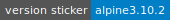

# Alpine test container

## accetto/dev-base-alpine

[Docker Hub][this-docker] - [Git Hub][this-github] - [Changelog][this-changelog]

***

This repository is just for testing and it is not intended to be actually used otherwise.

Real images with useful features can be found in my Docker Hub [accetto][accetto-docker] repository.

### Image set

- [accetto/dev-base-alpine][this-docker]

  Images based on the official [alpine][docker-alpine] images.

  - `latest` based on `alpine:latest`
  - `edge` based on `alpine:edge`

     

  

[this-docker]: https://hub.docker.com/r/accetto/dev-base-alpine
[this-github]: https://github.com/accetto/dev-base
[this-changelog]: https://github.com/accetto/dev-base/blob/master/CHANGELOG.md

[accetto-docker]: https://hub.docker.com/u/accetto/
[docker-alpine]: https://hub.docker.com/r/_/alpine/
